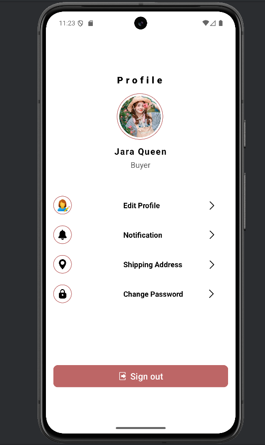

# 📱 Android Profile UI – XML Layout Only

A clean and modern **User Profile Screen UI** built using **XML layout** in **native Android development**. This is a front-end design showcasing a typical profile page with options for editing profile, notifications, shipping address, and password changes.

## 🖼️ Screenshot

## ✨ Features

- Profile picture with user name and role
- Profile edit button
- Notification settings
- Shipping address management
- Change password option
- Sign out button
- Modern and clean UI layout

## 🛠️ Built With

- **Android XML Layouts** (No backend or Java/Kotlin code included)

## 🚀 How to Use

1. Clone or download the project.
2. Open it in **Android Studio**.
3. Navigate to the `res/layout` folder.
4. Open the XML file (e.g., `activity_profile.xml`) to view or edit the layout.
5. Run on an emulator or real device (if Java/Kotlin code is added to handle activities).
